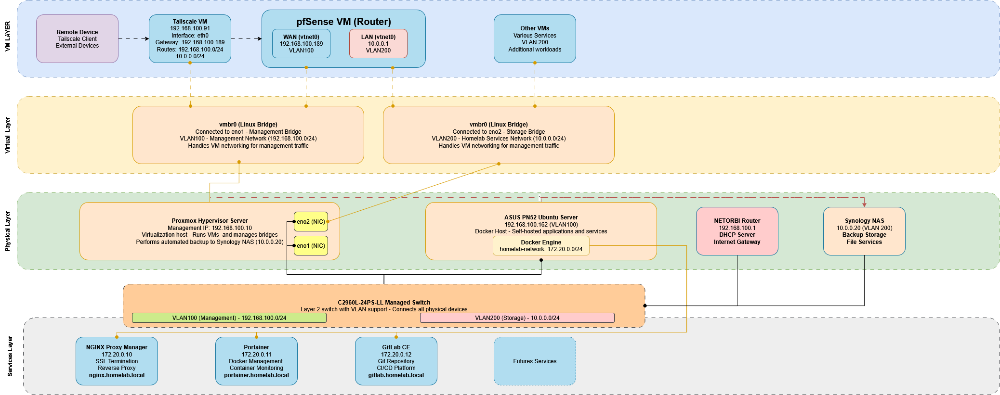

# Homelab Infrastructure

Documentation and configuration files for my self-hosted homelab infrastructure, built around virtualization, network segmentation, and automated service deployment.

# Repository  Structure
- [**Apps**](apps/README.md) - List of all apps and services I currently use
- **Media Server** - Jellyfin, *arr stack, and more
- **Server Monitoring** - Graphs and Visualizations for Proxmox and more
- **Storage** - Current storage and backup solution
- **Service Management**: Self-hosted applications with reverse proxy

## Hardware
### Servers and NAS
**Main Rig (Proxmox)**

Primary hypervisor running all production VMs. Features dual GPU passthrough for hardware-accelarated workloads.

- AMD EPYC 7532 (32C/64T)
- 96GB DDR4 3200MHZ ECC Server RAM
- NVIDIA RTX 3060 12GB 
- NVIDIA GTX 1050 4GB
- Intel 670p 512GB (Boot)
- SK Hynix Gold S31 1TB
- 2x Samsung 860 EVO 500GB

**ASUS PN52**

Bare-metal Ubuntu server acting as the primary network service host, handling reverse proxy, DNS filtering, and container management.
- AMD 5600H
- 8GB DDR4 3200MHZ SODIMM RAM
- Silicon Power SATA SSD 512GB

**Synology DS920+**

Primary NAS for media storage, system backups, and long-term metrics storage.

- Intel Celeron J4125 
- 4GB DDR4
- x2 Seagate Barracuda 4TB
- x1 Seagate Barracuda 3TB
- x1 Western Digital Blue 3TB

## Network
**Switching & Routing**

- [Cisco Catalyst 2960L-24TS-LL L2 Switch](https://www.cisco.com/c/en/us/support/switches/catalyst-2960-l-series-switches/series.html)

- pfSense (Firewall & Inter-VLAN Routing)

**Wireless**
- [2x UniFi U6-Lite (WiFi 6)](https://techspecs.ui.com/unifi/wifi/u6-lite)

**VLANS**
- VLAN 100 — Management & Services (192.168.100.0/24)
- VLAN 200 — Media (10.0.0.0/24)
## Network Diagram
