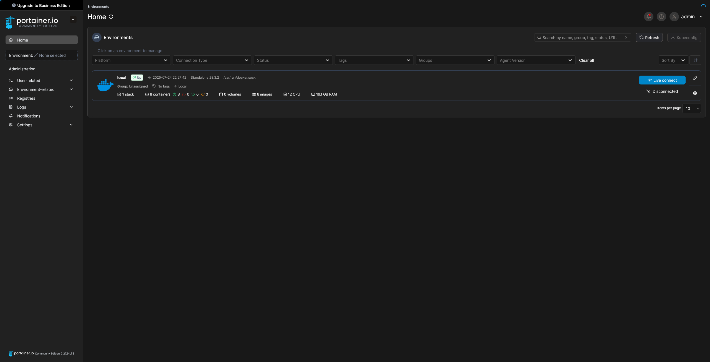
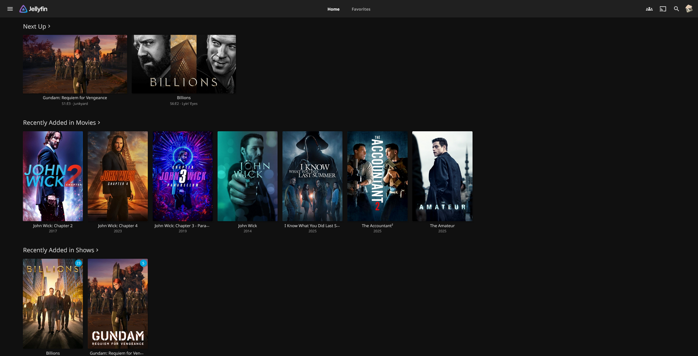
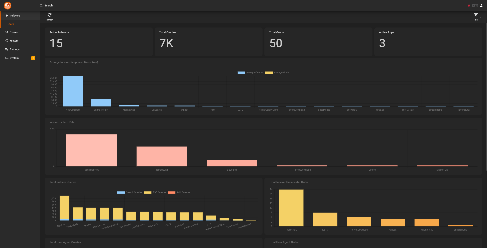
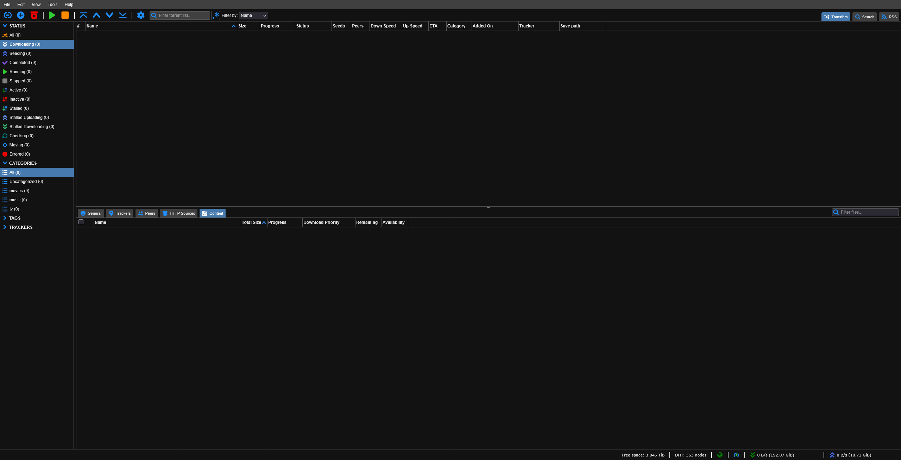
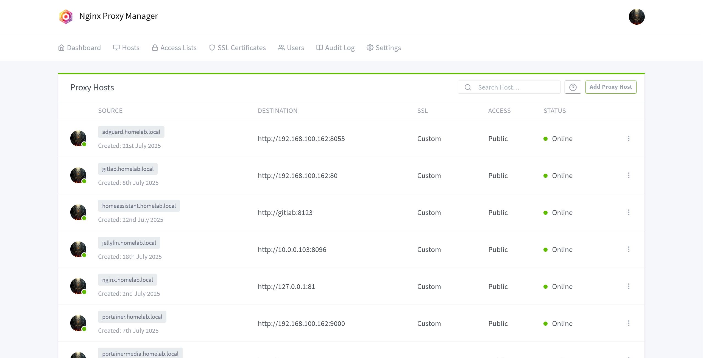
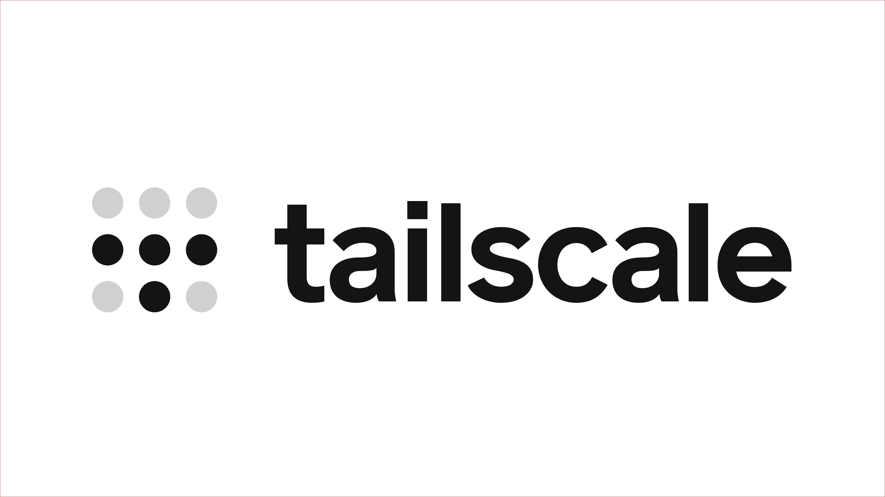

***This is a work in progress***

# Homelab 

This page in the homelab repository is a way to feature all of the apps that I'm running in my servers. While the purpose of this directory is to give a dedicated homepage of all the appds that don't need their own guides and resources, it will still feature everything that I run on my machines.

# Dashboards

Dashboards are used to create a simple webpage with links to all the services, websites, or anything that you really cares about. What makes dashboard special and unique is the features each of they come with. Many can act as a monitoring tools, widgets to get more details from services, weather, and more.

### Homepage

Homepage is one of the most feature-rich options out there when it comes to homepage services. Its simplicity and ease of setup are what stand out to me. You can use it to monitor and link to all your applications, like most tools in this category. Homepage acts as the start page for my web browser and gives me a quick overview of everything I care about. One of the best things about it is that everything in the dashboard is customizable and configured using a simple YAML file.

**Resources**: [Website](https://gethomepage.dev/) | [GitHub](https://github.com/gethomepage/homepage)

# Tools and Utilities

### Portainer

Portainer is a user-friendly web interface for managing Docker and Docker Compose environments. It is used to deploy, manage, and monitor containers, making these tasks easier for users.

**Resources**: [Website](https://docs.portainer.io/) | [GitHub](https://github.com/portainer/portainer)

# Media Server

### Jellyfin

Jellyfin is one of the best, if not the best, open-source media servers in the current FOSS space. It offers all the features you'd expect from a modern streaming service, but without any paywalls or subscriptions. This includes support for streaming to a wide variety of platforms.

**Resources**: [Website](https://jellyfin.org/) | [GitHub](https://github.com/jellyfin)

# Media Management

Many of the applications below function similarly to one another but with slightly different goals or media types.

### Radarr

Radarr is a movie management tool that helps you keep your collection organized. It scans your library so you can see what you have, lets you rename files, check quality, and even search indexers to automatically download new movies.

**Resources**: [Website](https://radarr.video/) | [Wiki](https://wiki.servarr.com/radarr) | [GitHub](https://github.com/Radarr/Radarr)

### Sonar

Sonarr does all the same stuff as Radarr, but for TV shows. It uses TVDB to figure out if you're missing any episodes, even those hard to find specials from your favorite series.

**Resources**: [Website](https://sonarr.tv/) | [Wiki](https://wiki.servarr.com/sonarr) | [GitHub](https://github.com/Sonarr/Sonarr)

### Prowlarr

Without using Prowlarr, you’ll need to manually set up trackers and indexers in each individual application. Prowlarr acts as a centralized hub for managing that across all your *arr apps.

**Resources**: [Website](https://prowlarr.com/) | [Wiki](https://wiki.servarr.com/prowlarr) | [GitHub](https://github.com/Prowlarr/Prowlarr)

# Download Clients

I highly recommend using a VPN when downloading, especially if you're using peer-to-peer (P2P) services. A VPN helps keep your public IP address hidden and adds an extra layer of privacy. I currently use [Surfshark VPN](https://surfshark.com/), as my main provider for P2P downloads.

### qBittorrent

This is web version of the popular qBittorrent peer-to-peer file sharing client. It's clean and simple with the necessary features. It works well with Surfshark and integrates well with various *arr applications.

**Resources**: [Website](https://www.qbittorrent.org/) | [GitHub](https://github.com/qbittorrent/qBittorrent)

# DNS and Remote Connections

### AdGuard

AdGuard Home is a network-wide ad and tracker blocker that helps keep your internet cleaner and faster. It filters out ads and tracking domains right at the DNS level, so every device on your network benefits. You can easily see what’s being blocked, control parental settings, and even enable encrypted DNS for extra privacy—all from a simple and clean dashboard.

**Resources**: [Website](https://adguard.com/en/welcome.html) | [GitHub](https://github.com/AdguardTeam/AdGuardHome)

# NGINX Proxy Manager

NGINX Proxy Manager is a simple, web based tool that makes it easy to set up and manage proxies for your apps or websites. It helps you forward domain names to the right services and handles creating secure SSL certificates, so your connections stay safe without any hassle.

**Resources**: [Website](https://nginxproxymanager.com/) | [GitHub](https://github.com/NginxProxyManager/nginx-proxy-manager)

# Tailscale

Tailscale is a super easy way to create a private network between your devices, no matter where they are. It lets you connect your computers, phones, and servers securely as if they were all on the same local network, without complicated setup. Basically, it’s like having your own VPN but way simpler to use.

**Resources**: [Website](https://tailscale.com/) | [GitHub](https://github.com/tailscale/tailscale)