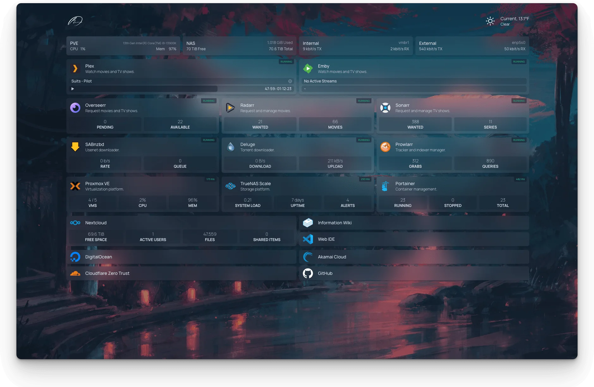

***This is a work in progress***

# Homelab 

This page in the homelab repository is a way to feature all of the apps that I'm running in my servers. While the purpose of this directory is to give a dedicated homepage of all the appds that don't need their own guides and resources, it will still feature everything that I run on my machines.

# Dashboards

Dashboards are used to create a simple webpage with links to all the services, websites, or anything that you really cares about. What makes dashboard special and unique is the features each of they come with. Many can act as a monitoring tools, widgets to get more details from services, weather, and more.

### Homepage

Homepage is one of the most feature-rich options out there when it comes to homepage services. Its simplicity and ease of setup are what stand out to me. You can use it to monitor and link to all your applications, like most tools in this category. Homepage acts as the start page for my web browser and gives me a quick overview of everything I care about. One of the best things about it is that everything in the dashboard is customizable and configured using a simple YAML file.

Resources: [Website](https://gethomepage.dev/) | [GitHub](https://github.com/gethomepage/homepage)

