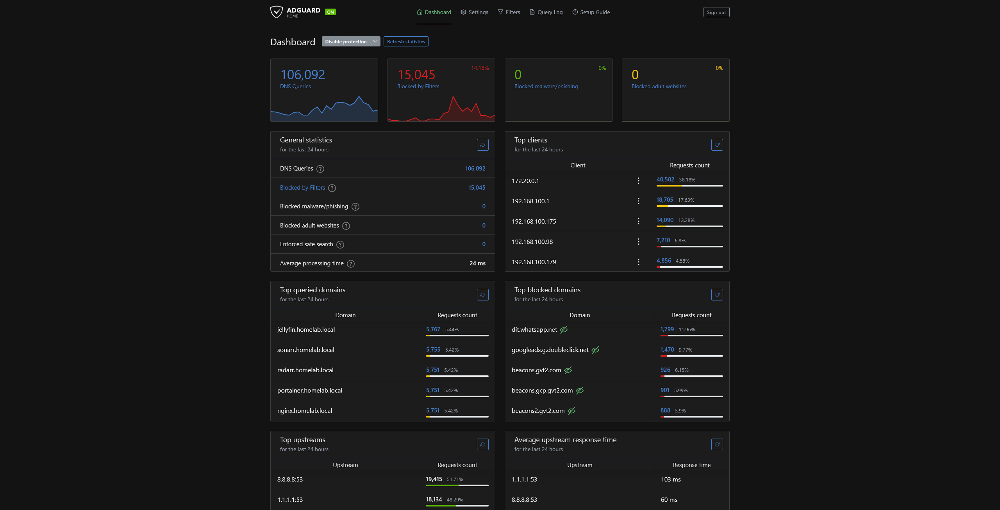
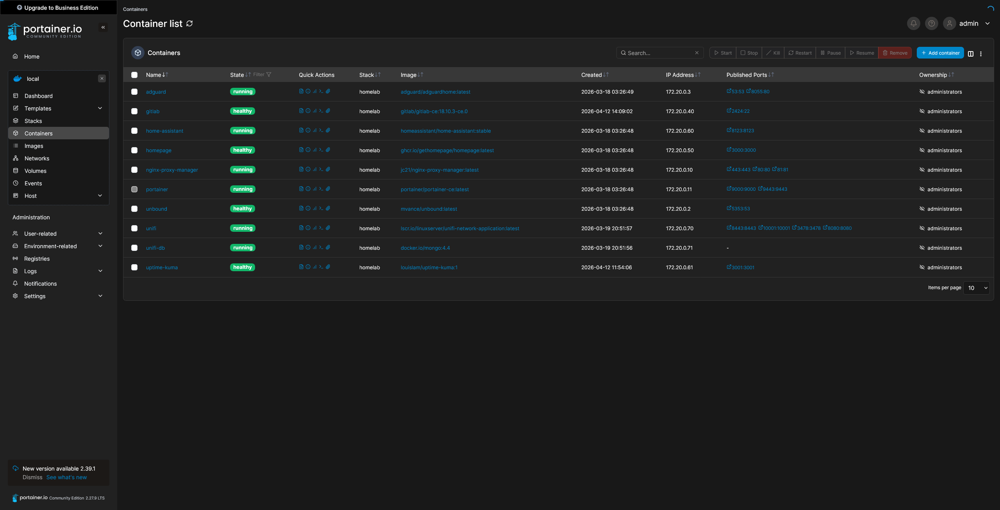

# Management

Services for network management, DNS filtering, and remote access.

## DNS & Ad Blocking

### AdGuard Home

AdGuard Home is a network-wide ad and tracker blocker that helps keep your internet cleaner and faster. It filters out ads and tracking domains right at the DNS level, so every device on your network benefits. You can easily see what’s being blocked, control parental settings, and even enable encrypted DNS for extra privacy—all from a simple and clean dashboard.

**Resources**: [Website](https://adguard.com/en/welcome.html) | [GitHub](https://github.com/AdguardTeam/AdGuardHome)

## Reverse Proxy

### NGINX Proxy Manager

NGINX Proxy Manager is a simple, web based tool that makes it easy to set up and manage proxies for your apps or websites. It helps you forward domain names to the right services and handles creating secure SSL certificates, so your connections stay safe without any hassle.

**Resources**: [Website](https://nginxproxymanager.com/) | [GitHub](https://github.com/NginxProxyManager/nginx-proxy-manager)

## Container Management

### Portainer

Portainer is a web-based container management UI for Docker environments. It makes it easy to manage containers, stacks, images, and networks across multiple hosts from a single interface.

**Resources**: [Website](https://www.portainer.io/) | [GitHub](https://github.com/portainer/portainer)

## Remote Access

### Tailscale

Tailscale is a super easy way to create a private network between your devices, no matter where they are. It lets you connect your computers, phones, and servers securely as if they were all on the same local network, without complicated setup. Basically, it’s like having your own VPN but way simpler to use.

**Resources**: [Website](https://tailscale.com/) | [GitHub](https://github.com/tailscale/tailscale)