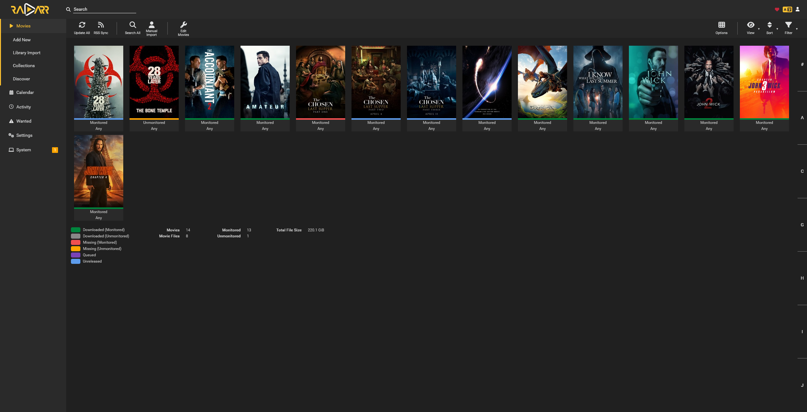
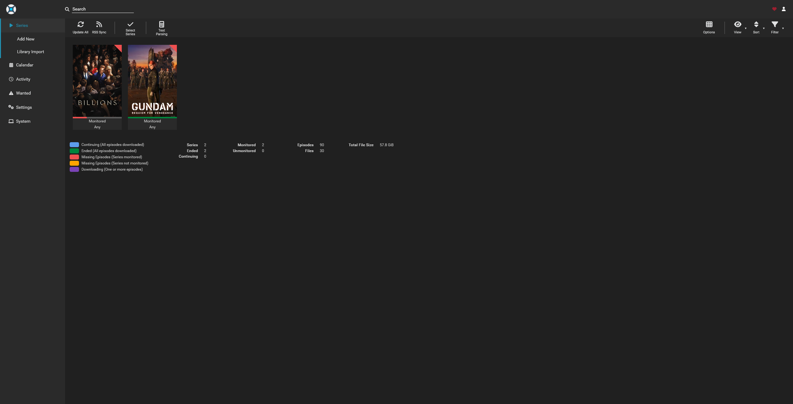
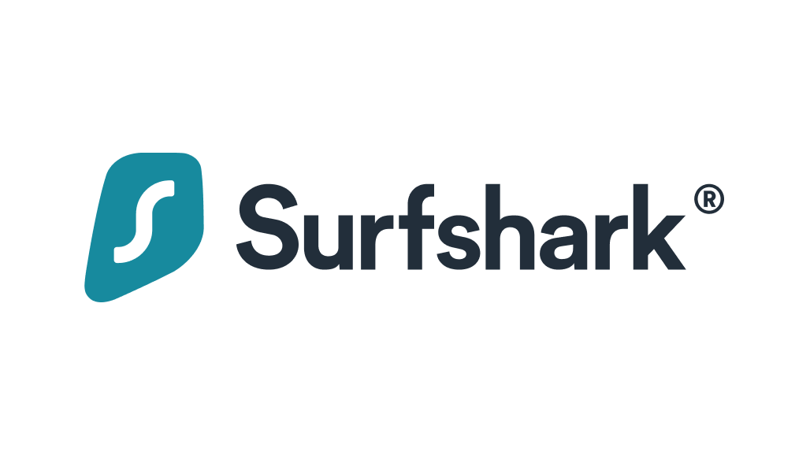

# Media

Services for media streaming, management, and downloads.

## Streaming

### Jellyfin

Jellyfin is one of the best, if not the best, open-source media servers in the current FOSS space. It offers all the features you'd expect from a modern streaming service, but without any paywalls or subscriptions. This includes support for streaming to a wide variety of platforms.

**Resources**: [Website](https://jellyfin.org/) | [GitHub](https://github.com/jellyfin)

## Media Management

### Radarr

Radarr is a movie management tool that helps you keep your collection organized. It scans your library so you can see what you have, lets you rename files, check quality, and even search indexers to automatically download new movies.

**Resources**: [Website](https://radarr.video/) | [Wiki](https://wiki.servarr.com/radarr) | [GitHub](https://github.com/Radarr/Radarr)

### Sonarr

Sonarr does all the same stuff as Radarr, but for TV shows. It uses TVDB to figure out if you're missing any episodes, even those hard to find specials from your favorite series.

**Resources**: [Website](https://sonarr.tv/) | [Wiki](https://wiki.servarr.com/sonarr) | [GitHub](https://github.com/Sonarr/Sonarr)

### Prowlarr

Without using Prowlarr, you’ll need to manually set up trackers and indexers in each individual application. Prowlarr acts as a centralized hub for managing that across all your *arr apps.

**Resources**: [Website](https://prowlarr.com/) | [Wiki](https://wiki.servarr.com/prowlarr) | [GitHub](https://github.com/Prowlarr/Prowlarr)

## Download Clients

I highly recommend using a VPN when downloading, especially if you're using peer-to-peer (P2P) services. A VPN helps keep your public IP address hidden and adds an extra layer of privacy. I currently use [Surfshark VPN](https://surfshark.com/), as my main provider for P2P downloads.

### qBittorrent

This is web version of the popular qBittorrent peer-to-peer file sharing client. It's clean and simple with the necessary features. It works well with Surfshark and integrates well with various *arr applications.

**Resources**: [Website](https://www.qbittorrent.org/) | [GitHub](https://github.com/qbittorrent/qBittorrent)